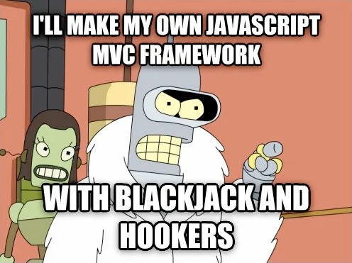

# basic-angular-form

## MaTS 

---

## What are front-end frameworks?

To understand a Front end framework, we need to know what the front-end is.  
The front-end of a website or application is the stuff visible to the user on the website.  
The graphics, typography, and arrangement of these two are what contribute.  
In addition, it includes building user-friendly interfaces and efficiently presenting the data from the back end to a user.

Thus, a Front-end Framework is a platform/tool to build the front end of your website.  
Some tasks one can perform using a Front-end Framework are – the management of AJAX requests, associating data with The Document object Model (DOM) elements, defining a file structure, and styling of components on the website or application.

## What are the best frameworks for *large applications*?

### Frameworks 
1. Angular
2. React
3. Vue
4. Svelte

### 1. Angular

#### Pros

#### Cons

### 2. React

#### Pros

#### Cons

### 3. Vue

#### Pros

#### Cons

### 4. Svelte

#### Pros

#### Cons

## Sources

- https://angular.io/docs
- https://technostacks.com/blog/best-frontend-frameworks/
- https://www.monocubed.com/blog/best-front-end-frameworks/