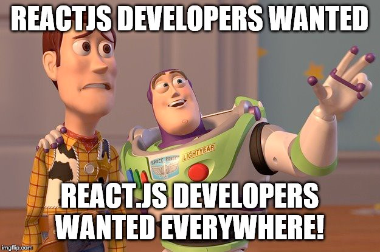
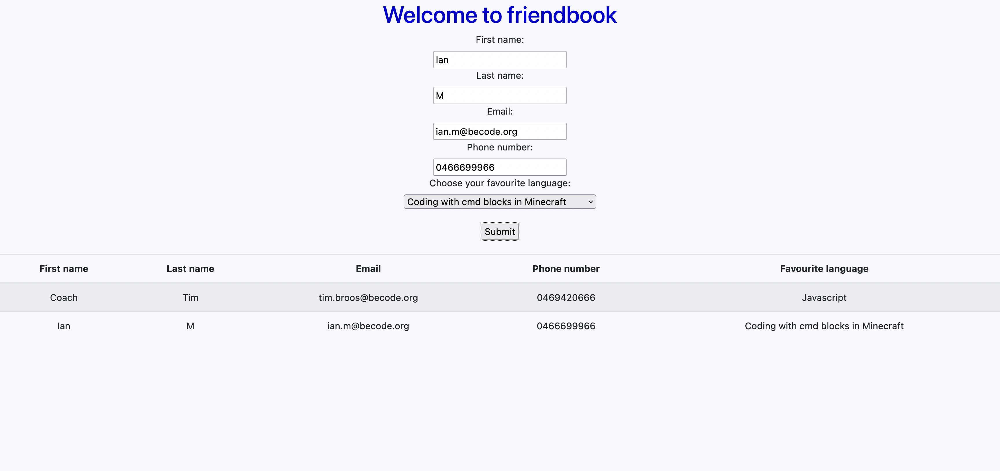

# basic-angular-form

## MaTS 


---

## What are front-end frameworks?

To understand a Front end framework, we need to know what the front-end is.  
The front-end of a website or application is the stuff visible to the user on the website.  
The graphics, typography, and arrangement of these two are what contribute.  
In addition, it includes building user-friendly interfaces and efficiently presenting the data from the back end to a user.

Thus, a Front-end Framework is a platform/tool to build the front end of your website.  
Some tasks one can perform using a Front-end Framework are – the management of AJAX requests, associating data with The Document object Model (DOM) elements, defining a file structure, and styling of components on the website or application.

## What are the best frameworks for *large applications*?

### Frameworks to talk about
1. Angular
2. React
3. Vue
4. Svelte

### 1. Angular (The one I used in this assignment)


#### Pros

- The in-built functionality of this framework allows real-time model-view synchronization and makes it easier to make any changes to the application.
- The presence of Directives allows the developers to play around with the Document Object Model (DOM) and create rich content using HTML.
- Dependency injectors allow the developers to decouple interdependent components of code and reuse these components however they need.
- Angular gained popularity among the developers since it was launched. Today, there’s a big community of web developers who use Angular. A developer can easily seek help from this community if he faces an issue.


#### Limitations

- The wide variety of features and built-in functionalities make Angular a very complex language to learn.
- Dynamic applications can lag sometimes and may not perform upto the mark.

#### Applications
Angular is the go-to option for most enterprise-based and dynamic web applications due to its two-way data binding that allows browser-based applications to augment.

#### When Can you not use Angular?
Angular is the complete dynamic solution as a Framework.  
Thus, if you want to build small-scale web applications, you may not want to opt for angular because you would not utilize its resources to the best.  
It would merely be a misuse of time and resources.  
Furthermore, if you are a new developer with a small team, you should avoid using the complex Frameworks like Angular.

### 2. React



#### Pros

- React is easy to learn and use.
- React allows you to reuse an already built component in your code. This way, it’s easier to collaborate and use these components in other parts of the application.
- Use of its virtual DOM allows a seamless performance and ensures that even high-load applications have fast rendering.
- Increased productivity and maintenance. New changes in the application can be easily made.
- It has a browser extension named ```React Developer Tools```, which allows them to make detailed observations of their components and make them better.

#### Limitations


- In the initial phases of learning React, it can be difficult for the developers to understand the concepts of JSX.
- ReactJS is used for developing only the UI part of the application. Therefore, to get complete development tools, you will have to rely on other technologies.
- As the components can be easily updated at high speed, it isn’t easy to maintain proper documentation.

#### Applications
React is mostly used for developing single-page applications.  
However, it is a framework specifically used for User Interface development.  
It comes in quite handy when you require building an interactive interface for an application within a limited time because you can reuse the components in this framework.

#### Where can you not use React?
JSX is pretty tough when it comes to learning.  
Therefore, if you are a new developer, it’s recommended not to use React.  
Secondly, the knowledge of JavaScript is necessary for using React.  
In case you don’t know JavaScript, React is not the go-to option for you.

### 3. Vue


#### Pros

- Availability of detailed documentation for learners.
- Supports the development of both complex dynamic applications and simpler smaller applications.
- The syntax of this framework is very simple and thus easier to work with.
- Presence of a virtual DOM.

#### Limitations

- Vue, being in high demand in China, has many of its documentation built-in Chinese, which creates a language barrier for people accessing these documents outside of China.
- VueJs is still in its growing stages and thus does not have a large community.
- VueJs provides a wide range of features, but it’s not as big as React or Angular.

#### Applications 
VueJs is suggested to be used for projects that need greater flexibility.  
You can design everything from scratch and therefore allows designing dynamic applications with more ease.

#### When not to use
Despite having a wide range of features, VueJs is still not successful in creating stable components.  
Another reason why you wouldn’t want to opt for VueJs is if you’re looking for a community where you can seek help if you face any hurdles.

### 4. Svelte


#### Pros

- Uses current JavaScript libraries to render a simple framework
- SEO-optimized frontend framework
- Lightweight and responsive
- Minimal coding with feature-focussed architecture
- Scalable

#### Limitations

- Lack of technical support and tutorials
- Small, limited ecosystem
- Limited tooling and less popular amongst developers

#### Applications
Svelte is apt for small projects that limited people handle.  
The framework is ideal for beginners due to its simple syntax and less load on the browser.  
This helps in speeding up the web or app product.

#### When not to use?
Developers dealing with complex projects should avoid using Svelte.  
The framework offers limited tooling and a small community, making it challenging to deal with bugs and challenges that come in a later stage of development.

---
### Learning objectives

- Use the angular cli commands
- Have a basic understanding of typescript
- Generate components and services in angular
- Configure a provided node API
- Make a basic angular form
- Send http requests from an angular app to a node server

---
## The mission

Make an Angular application on which your friends can fill in their data so you can have it in your node.js friendlist api.

### Must-have features

All the fields you need to put the data of your friends in your friendlist. These are:

- First name
- Last name
- Email
- Phone number
- Favourite language (html, css, js, php, ...), this will be a select with options

Error reporting, give some visual feedback to the user if they put something wrong in the inputs.

Form validation

A Friend list, do this by sending a GET request to your local node server.

A POST request to add a friend to your friend list.

### Nice-to-have features

Make sure the email and phone number are actually emails and phone numbers.
Make it as easy as possible for a user to add a phone number, following phone numbers could all be valid:
- 0488888888
- +324888 88888
- 04 88 88 88 88
- 0 4 8 8 8888 88  
It's okay to only take Belgian phone numbers into account.
Make seperate pages for adding a friend and your friend list.
Make a "best friend" list by adding a favourite checkbox to the form
- You can also make a seperate page for your best friends
- You'll have to make a new app.GET function in your node server
Add extra fields, whatever you like. Examples:
- Profile picture
- Signature move
- Favourite meme
- ...  
Think of your own new app.GET function, the possibilities are endless. Examples:
- A list of all the people that like php
- An amount of random friends from your list
- A list of all the people between the age of 30 and 40
- ...

---
## What does the page look like?



(Went for the old microsoft vibe)

## Sources

- https://angular.io/docs
- https://technostacks.com/blog/best-frontend-frameworks/
- https://www.monocubed.com/blog/best-front-end-frameworks/